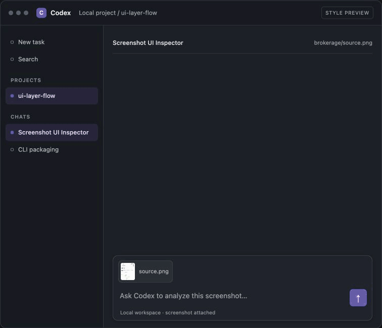

# Screenshot UI Inspector

`ctrlc` 0.1.0 measures screenshot UI, renders saved scenes, and previews the
resulting inspector locally. Shell-capable agents invoke the CLI without model
integration in `ctrlc`.



## Tested agent runtimes

| Agent runtime | Model | Test status |
| --- | --- | --- |
| Codex | GPT-6.1 Sol (`gpt-6.1-sol`) | Tested |
| Codex | Other models | Not tested |
| Claude Code | Not recorded | Not tested |
| Other shell-capable agents | Not recorded | Not tested |

Only Codex with GPT-6.1 Sol has been tested. Agents using GLM or Grok are also
untested. CLI compatibility alone does not verify an agent's optional semantic
review.

## Installation

Install [uv](https://docs.astral.sh/uv/getting-started/installation/) if needed.
Python 3.10 or newer is required. From this checkout, install the command with:

```bash
uv tool install .
```

If `ctrlc` is already installed, replace that installation with:

```bash
uv tool install --force .
```

Native Vision OCR requires macOS and `swiftc`. On other platforms, use
`--ocr-json` with OCR data from another provider.

## Usage

The saved brokerage example shows the rendering flow:

```bash
ctrlc render brokerage/reviewed-scene.json brokerage/source.png --out brokerage/inspector.html
ctrlc serve brokerage/inspector.html --port 0
```

`render` uses the reviewed scene and its matching screenshot, preserves the
white canvas and style panels, and leaves saved extraction data untouched.

## Commands

| Command | Purpose |
| --- | --- |
| `ctrlc extract IMAGE --out DIR` | Measure a screenshot; add `--roi`, `--languages`, `--ocr-json`, `--refresh`, or `--inspector` as needed. |
| `ctrlc render SCENE IMAGE --out HTML` | Render a saved scene without repeating extraction or OCR. |
| `ctrlc serve HTML [--port PORT]` | Serve one inspector on localhost; use port `0` to choose an available port. |
| `ctrlc --help` / `ctrlc COMMAND --help` | Show readable command help. |
| `ctrlc --version` | Print the installed version. |

Successful commands print JSON to stdout. Failures print JSON to stderr and
exit with status 2 for argument errors or 1 for workflow errors; success exits
0. The root scripts `extract_ui.py`, `render_inspector.py`, and
`preview_server.py` remain compatibility commands.

## Development

Sync the project and test dependencies, then run the installed-package E2E:

```bash
uv sync --extra test
uv run --extra test python -m unittest test_cli_e2e -v
```

The existing regression checks are also available:

```bash
uv run --extra test python -m unittest test_extract_ui test_render_inspector -v
node --test test_alpha_matte.js
```

Reusable Python functions are `run_extraction`, `render_scene`, and
`create_preview_server`. The renderer template and native OCR helper live in
`ctrlc/assets/`.

## Contributions

Read [AGENTS.md](AGENTS.md) and [PATTERN.md](PATTERN.md) before changing a
workflow. Keep changes scoped, preserve measured evidence and the self-contained
white-panel inspector, and add command-level E2E coverage only for a new
workflow or material failure.
